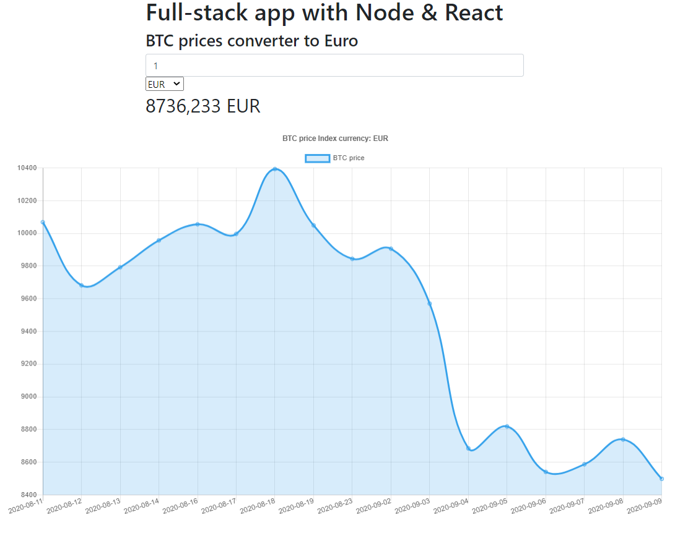

## BTC Converter with price chart

App developed with <b>Node</b> as BackEnd, <b>React</b> as FrontEnd and <b>Chart.js</b> library to represent the obtained data. 
Data obtained from https://www.coindesk.com/ API. 
 
<h3>Steps to run the App</h3>
 
1-Run `npm start` inside back folder to start the BackEnd. 
2-Run `npm start` inside front folder to start the React App. 
 
<h3>Screenshot</h3> 

